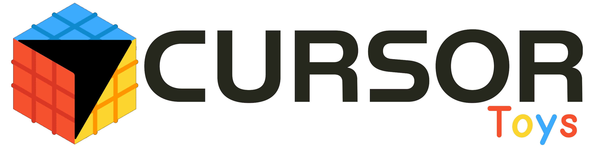

<p align="center">
    <picture>
      <source media="(prefers-color-scheme: light)" srcset="./resources/icon.png" width="200" />
      
  </picture>
</p>
<p align="center">
  <span align="center">A powerful collection of utilities that transform Cursor AI into a collaborative productivity powerhouse.</span>
</p>
<h3 align="center">
  <a href="#-installation">Installation</a>
  <span> · </span>
  <a href="#-utilities">Utilities</a>
  <span> · </span>
  <a href="#-quick-start">Quick Start</a>
  <span> · </span>
  <a href="#-whats-new">What's New</a>
</h3>
<br/><br/>

## 🔨 Utilities

CursorToys includes over 10 utility categories to optimize your Cursor AI workflow:

|   |   |   |
|---|---|---|
| [🤖 AI Text Refinement](#-ai-text-refinement) | [🎯 Smart Recommendations](#-smart-recommendations) | [🔗 Instant Sharing](#-instant-sharing) |
| [🌐 In-Editor API Testing](#-in-editor-api-testing) | [📚 Personal Libraries](#-personal-libraries) | [📓 Project Notepads](#-project-notepads) |
| [🪝 Cursor Hooks](#-cursor-hooks) | [🎓 Skills Management](#-skills-management) | [🗜️ File Minification](#️-file-minification) |
| [💬 Chat Integration](#-chat-integration) | [🌐 GitHub Gist Integration](#-github-gist-integration) | |

> **🧪 NEW in v1.10.0**: HTTP Request Assertions — Automate API testing with `@assert()` annotations!

### 🤖 AI Text Refinement

**Enhance text and code quality with AI** — Powered by Google Gemini.

- ✨ **Smart Refinement** — Fix typos, improve clarity, enhance flow automatically
- 🎯 **Process with Custom Prompts** — Use any prompt from your library to process text
- ⌨️ **Keyboard Shortcuts** — `Cmd+Shift+R` for selection, `Cmd+Alt+Shift+R` for clipboard
- 🔐 **Secure Storage** — API keys stored using VS Code Secrets API
- 🎯 **Context Preservation** — Maintains original language and intent
- ⚙️ **Configurable** — Custom prompts and model selection (Gemini 2.5 Flash/Pro)
- 📋 **Clipboard Support** — Refine clipboard text and paste anywhere
- 🚀 **Fast & Reliable** — Native implementation, no external dependencies, optimized performance
- 📚 **Prompt Library Integration** — Access prompts from both personal and project folders

**Quick Start:**
1. Select text in editor → Press `Cmd+Shift+R`
2. Text is refined in place instantly
3. First use prompts for API key (get free key at [Google AI Studio](https://aistudio.google.com/apikey))

**Process with Custom Prompts:**
1. Select text or copy to clipboard
2. Run "CursorToys: Process with Prompt" command
3. Choose a prompt from your library (personal or project)
4. Text is processed and replaced/clipped automatically

### 🎯 Skills Marketplace

**Discover community-driven Agent Skills** — Browse and install skills from Tech Leads Club.

- 🌐 **Tech Leads Club Integration** — Access community-driven skills catalog
- 🎨 **Elegant Browser** — Visual interface with category filters and search
- 🔍 **Smart Search** — Find skills by name, description, category, or author
- 📦 **Direct Installation** — Install via terminal with one click
- 🏷️ **Category Organization** — Browse by skill categories
- 📝 **Rich Metadata** — Author, version, and subfolder information
- 🔗 **GitHub Integration** — View source code on GitHub
- ⚡ **Smart Caching** — Fast performance with memory and disk caching

**Quick Start:**
1. Run "CursorToys: Browse Recommendations Marketplace" command
2. Browse skills by category or search by keyword
3. Click "Install in Cursor" to install directly
4. Skills are added to your `.cursor/skills/` or `.claude/skills/` folder

### 🔗 Instant Sharing

**Share AI configurations with one click** — No screenshots or copy-pasting.

- 🎯 **One-Click Links** — Convert commands, rules, and prompts to deeplinks or CursorToys format
- ⌨️ **Fast Import** — `Cmd+Shift+I` to import from any link
- 🔄 **Multiple Formats** — Deeplink, web URL, CursorToys compressed format, or GitHub Gist
- 👥 **Team Sync** — Everyone uses the same AI instructions
- 📦 **CursorToys Format** — New compressed format ideal for large files (no URL length limits)
- 🌐 **Chrome Extension** — Send web selection to Cursor via deeplink; see in the [Chrome Web Store](https://chromewebstore.google.com/detail/cursor-toys/kndhfkcjndndofieoceaknoapaadjebb)

### 🌐 In-Editor API Testing

**Test APIs without leaving Cursor** — Full REST client built-in with automated testing.

- 🚀 **Execute Requests** — Run HTTP requests from `.req` files with CodeLens
- 📝 **Multiple Formats** — cURL commands or REST Client format (METHOD URL)
- 🧪 **Automated Testing** — Built-in assertion system with `@assert()` annotations
- ✅ **27+ Assertion Operators** — Validate status, headers, body, types, and more
- 📊 **Test Results** — Pass/fail indicators with actual vs expected values
- ⚡ **Performance Tracking** — See execution time for each request
- 🎨 **Syntax Highlighting** — Beautiful highlighting for requests and responses
- 🌍 **Environment Variables** — Use `{{variableName}}` from `.env` files
- 🔧 **Inline Variables** — Define variables with `# @var VAR_NAME=value` directly in files
- 🎯 **Helper Functions** — Dynamic values: `{{@uuid()}}`, `{{@datetime}}`, `{{@randomIn()}}`, `{{@prompt()}}`, `{{@userAgent()}}`, `{{@ip()}}`, `{{@lorem()}}`, `{{@randomFrom()}}`
- 🔄 **Multiple Environments** — Switch between dev, staging, prod instantly
- 💾 **Auto-Save Responses** — Or preview-only mode for quick tests
- ⚙️ **Configurable** — Timeout, default environment, environments folder name (`.environments`), assertion options
- 📘 **HTTP Requests Skill** — Install a Cursor Agent Skill with full documentation: right-click the **HTTP folder** (e.g. `.cursor/http/`) in the Explorer and choose **"CursorToys: Add Skill: HTTP Requests Documentation"**. The skill is added to your personal skills; the AI will use it when you work with `.req`/`.request` files, environments, and assertions.

**Quick Start - HTTP Assertions:**
```http
/*
 * @assert("Status should be 200", "res.status", "equals", 200)
 * @assert("Response should have userId", "res.body.userId", "isDefined")
 * @assert("User age should be greater than 18", "res.body.age", "gt", 18)
 */
GET https://api.example.com/user/123
```
Click "Send Request" → See assertion results inline!

### 📚 Personal Libraries

**Build reusable libraries** — Commands that work across all projects.

- 🗂️ **Visual Tree View** — Browse all personal commands and prompts in Explorer sidebar
- 🏠 **Personal + Project** — Separate libraries for personal and project-specific
- ✏️ **Easy Management** — Rename, delete, reveal in folder
- 🔍 **Smart Filtering** — Filter by file extensions
- 📂 **Hierarchical Folders** — Organize in subfolders with drag-and-drop
- 🎯 **Drag & Drop** — Move commands/prompts between folders easily

### 📓 Project Notepads

**Build project-specific documentation** — Notepads that stay with your project.

- 📝 **Project Notepads** — Workspace-specific markdown notes in `.cursor/notepads/`
- 🗂️ **Visual Tree View** — Browse and manage notepads in Explorer sidebar
- 📂 **Hierarchical Organization** — Organize notepads in subfolders with drag-and-drop
- ✏️ **Easy Management** — Create, rename, delete, and reveal notepads
- 🔗 **Shareable** — Generate CursorToys shareables or Gist for individual notepads or entire folders
- 🎯 **Drag & Drop** — Move notepads between folders easily
- 🔄 **Auto-Refresh** — File system watchers keep tree view in sync

### 🪝 Cursor Hooks

**Manage Cursor hooks configuration** — Automate workflows with hooks.

- 📄 **Hooks Management** — Visual interface for managing hooks.json files
- 🏠 **Personal + Project** — Separate hooks for personal (all projects) and project-specific
- 🗂️ **Visual Tree View** — Browse hooks and associated scripts in Explorer sidebar
- ✏️ **Easy Management** — Create, share, delete, reveal hooks files
- 🔗 **Shareable** — Share hooks via CursorToys format or GitHub Gist
- 📝 **Script Detection** — Automatically detects and displays hook scripts
- 🎯 **Context Menu** — Right-click actions for all hook operations

### 🎓 Skills Management

**Manage Cursor Skills** — Complete support for Cursor Skills with visual tree view.

- 🗂️ **Visual Tree View** — Browse and manage skills in Explorer sidebar
- 🏠 **Personal + Project** — Separate skills for personal (`~/.cursor/skills/`, `~/.claude/skills/`) and project-specific (`workspace/.cursor/skills/`)
- 📁 **Hierarchical Organization** — Organize skills in folders with drag-and-drop support
- ✏️ **Easy Management** — Open, rename, delete, reveal skills
- 🔗 **Shareable** — Share individual skills or entire folders as bundles
- 📝 **SKILL.md Support** — Automatic detection of SKILL.md files in skill folders
- 🎯 **CodeLens Integration** — Share skills directly from SKILL.md files
- 🔄 **Auto-Refresh** — File system watchers keep tree view in sync

### 🗜️ File Minification

**Optimize files and clipboard content** — Reduce file sizes instantly.

- 📦 **Minify Files** — One-click minification for JSON, HTML, XML, CSS, SVG, JS, TS
- 📋 **Clipboard Minification** — Minify clipboard content with auto-detection
- 📊 **Statistics** — See original size, minified size, and savings percentage
- ⚙️ **Configurable** — Customize output suffix and behavior
- 🎯 **Context Menu** — Right-click any supported file → Minify File

### 💬 Chat Integration

**Send code to Cursor AI faster** — No manual copy-paste.

- ✂️ **Send Selection** — Right-click → Send to Chat
- 🔗 **Prompt Deeplinks** — Generate shareable prompt links from selected code
- 📝 **Custom Text** — Send any text directly to chat
- 📍 **Context Included** — File path, language, and line numbers auto-added

### 🌐 GitHub Gist Integration

**Share via GitHub Gist** — Maximum compatibility, discoverability, and browser viewing.

- ✅ **Browser Viewing** — Recipients can view without importing
- ✅ **Maximum Compatibility** — Works with any editor, not just Cursor
- ✅ **Public or Private** — Control visibility of shared content
- ✅ **Permanent Links** — Gists stay accessible on GitHub
- ✅ **Version History** — GitHub tracks gist changes
- ✅ **Embedded Viewing** — Gists can be embedded in docs

<br/><br/>

## 📋 Installation

For detailed installation instructions and system requirements, visit the [complete documentation](https://github.com/CursorToys/cursor-toys).

But to get started quickly, choose one of the installation methods below:
<br/><br/>
<details open>
<summary><strong>VS Code Marketplace (Recommended)</strong></summary>
<br/>

**For Cursor/VS Code:**
1. Open Extensions (`Cmd+Shift+X` / `Ctrl+Shift+X`)
2. Search for **"Cursor Command Toys"**
3. Click Install

**Direct Links:**
- [VS Code Marketplace](https://marketplace.visualstudio.com/items?itemName=Godrix.cursor-toys)
- [Open VSX Registry](https://open-vsx.org/extension/godrix/cursor-toys) (for Cursor and other editors)

</details>

<details>
<summary><strong>Manual Installation via VSIX</strong></summary>
<br/>

1. Download the latest `.vsix` from [GitHub Releases](https://github.com/CursorToys/cursor-toys/releases)
2. Open Command Palette (`Cmd+Shift+P` / `Ctrl+Shift+P`)
3. Run **"Extensions: Install from VSIX..."**
4. Select the downloaded file

</details>

<details>
<summary><strong>Development/Local Build</strong></summary>
<br/>

Clone the repository and compile locally:

```bash
git clone https://github.com/CursorToys/cursor-toys.git
cd cursor-toys
npm install
npm run compile
npm run package
```

Install the generated `.vsix` file via Extensions → Install from VSIX.

</details>

## 🚀 Quick Start

### Get Started in 60 Seconds

**Step 1: Test an API (30 seconds)**
```bash
# Create .cursor/http/api-test.req in your project
curl -X GET https://api.github.com/users/octocat
```
Click the "Send Request" link that appears above → See formatted response!

**Step 2: Share a Command (20 seconds)**
1. Create `.cursor/commands/my-command.md`
2. Right-click → "Generate Cursor Toys Command"
3. Link copied! Share it anywhere.

**Step 3: Import Team Config (10 seconds)**
1. Press `Cmd+Shift+I` (Mac) or `Ctrl+Shift+I` (Windows/Linux)
2. Paste a deeplink
3. Done! File created automatically.

### Main Commands

| Command | Shortcut | Description |
|:--------|:---------|:------------|
| **CursorToys: Refine Selection with AI** | `Ctrl+Shift+R` / `Cmd+Shift+R` | Refine selected text with AI |
| **CursorToys: Refine Clipboard with AI** | `Ctrl+Alt+Shift+R` / `Cmd+Alt+Shift+R` | Refine clipboard text with AI |
| **CursorToys: Process with Prompt** | — | Process text using a custom prompt from your library |
| **CursorToys: Import from Link** | `Ctrl+Shift+I` / `Cmd+Shift+I` | Import deeplink, CursorToys, or GitHub Gist |
| **CursorToys: Check Recommendations** | — | Check recommendations for the project |
| **CursorToys: Browse Marketplace** | — | Browse recommendations marketplace |
| **CursorToys: Send HTTP Request** | — | Execute HTTP request from file |
| **CursorToys: Run HTTP Assertions Tests** | — | Run assertions for HTTP request file |
| **CursorToys: Select HTTP Environment** | — | Switch between HTTP environments |
| **CursorToys: Minify File** | — | Minify current file |
| **CursorToys: Trim & Minify Clipboard** | — | Auto-detect and minify clipboard |
| **CursorToys: Send Selection to Chat** | — | Send selected code to Cursor chat |

**Pro Tip**: Most commands are accessible via CodeLens (clickable links in your files) or context menu (right-click)!

## ✨ What's New

**Version 1.10.0 (16 February 2026)**

For a detailed look at the latest changes, visit the [CHANGELOG](CHANGELOG.md).

**✨ Highlights**

- ✅ **HTTP Request Assertions** — Complete automated testing system with `@assert()` annotations
- ✅ **27+ Assertion Operators** — Validate status, headers, body properties, types, and more
- ✅ **Flexible Assertion Syntax** — Support for multiple formats with optional descriptions
- ✅ **Rich Test Results** — Pass/fail indicators with actual vs expected values inline in `.res` files
- ✅ **Expression Resolution** — Access nested properties with dot notation (`res.body.users[0].name`)
- ✅ **Configurable Testing** — Enable/disable assertions, inline results, fail-on-error behavior
- ✅ **HTTP Docs Skill** — Install the "HTTP Requests Documentation" Agent Skill: **right-click the HTTP folder** (e.g. `.cursor/http/`) in the Explorer and choose **"CursorToys: Add Skill: HTTP Requests Documentation"**. The AI then uses this skill when you work with `.req` files. Content matches canonical SKILL.md (operators, best practices, CLI testing).
- ✅ **Configurable Environments Folder** — `cursorToys.environmentsFolder` (default `.environments`) for environment files path

### HTTP Request Assertions System
- **Test Automation**: Write assertions directly in HTTP request files using `@assert()` annotations
- **27+ Operators**: Comparison (`equals`, `gt`, `lte`), String (`contains`, `matches`), Type checks (`isNull`, `isArray`), and more
- **Flexible Syntax**: 
  - With description: `@assert("Status should be 200", "res.status", "equals", 200)`
  - Without description: `@assert("res.body.userId", "isDefined")`
  - With regex: `@assert("res.body.email", "matches", /^[\w\.-]+@[\w\.-]+\.\w+$/)`
- **Expression Resolution**: Access response properties with dot notation and array indexing
- **Result Display**: Inline results in `.res` files with ✓/✗ indicators and summary statistics
- **Configuration Options**: 
  - `cursorToys.httpAssertionsEnabled`: Enable/disable assertions (default: true)
  - `cursorToys.httpAssertionsShowInline`: Show results inline (default: true)
  - `cursorToys.httpAssertionsFailOnError`: Stop on failure (default: false)

**Version 1.9.0 (February 2026)**

**✨ Highlights**

- ✅ **Skills Marketplace Integration** — Browse and install community skills from Tech Leads Club
- ✅ **New HTTP Helper Functions** — `@userAgent()`, `@ip()`, `@lorem()`, `@randomFrom()` for dynamic testing
- ✅ **HTTP Documentation Generator** — Auto-generate comprehensive llms.txt documentation
- ✅ **Streamlined Recommendations** — Focused on Skills Marketplace, removed legacy features
- ✅ **Better Marketplace UI** — Category filters, search, GitHub integration, visual indicators

### Skills Marketplace Integration
- **Tech Leads Club Integration**: Browse community-driven Agent Skills catalog
- **Direct Installation**: Install skills via terminal with one click (`npx @tech-leads-club/agent-skills`)
- **Rich Metadata**: See author, version, and available resources (references, scripts, assets)
- **GitHub Links**: View skill source code directly on GitHub
- **Smart Caching**: Fast browsing with 1-hour memory cache and 24-hour disk cache

### Enhanced HTTP Testing
- **New Helper Functions**: Generate random User-Agent strings, IP addresses, Lorem Ipsum text, and pick random items
- **Documentation Generator**: Create comprehensive HTTP features documentation with examples
- **Better Testing**: Perfect for API mocking, load testing, and data generation
- **Use Cases**: `{{@userAgent()}}`, `{{@ip()}}`, `{{@lorem(20)}}`, `{{@randomFrom("a", "b", "c")}}`

**Version 1.8.0 (January 2026)**

**✨ Highlights**

- ✅ **Enhanced Skills Management** — Create skills, move to personal library, improved sharing
- ✅ **AI Architecture Refactoring** — Simplified implementation, removed external dependencies, better performance
- ✅ **Process with Custom Prompts** — New command to process text using prompts from your library
- ✅ **Improved Command Organization** — Better context menus and command titles
- ✅ **Keyboard Shortcuts** — Improved global shortcut support for text refinement

### Enhanced Skills Management
- **Create Skills**: New command to create skill templates from Skills view
- **Move to Personal Library**: Move project skills to personal folder for reuse across projects
- **Improved Sharing**: Share personal commands and prompts as CursorToys format directly from tree view
- **Folder-Based Structure**: Skills now displayed as folders matching actual file structure

### AI Text Refinement Improvements
- **Simplified Architecture**: Refactored to use direct Gemini API implementation (no external dependencies)
- **Process with Prompt**: New command to process text using any prompt from your personal or project library
- **Better Performance**: Removed `@google/genai` dependency, using native `fetch` for faster execution
- **Improved Error Handling**: Enhanced error messages and timeout management
- **Streamlined Configuration**: Simplified API key management with clearer command names

**Version 1.7.0 (January 2026)**

**✨ Highlights**

- ✅ **AI Text Refinement** — Enhance text and code quality with Google Gemini
- ✅ **Keyboard Shortcuts** — `Cmd+Shift+R` (selection) and `Cmd+Alt+Shift+R` (clipboard)
- ✅ **Secure API Storage** — API keys stored using VS Code Secrets API
- ✅ **HTTP Documentation** — Auto-generated llms.txt with comprehensive HTTP features guide
- ✅ **Configurable AI** — Custom prompts and model selection (Gemini 2.5 Flash/Pro)

**Version 1.6.0 (January 2026)**

**✨ Highlights**

- ✅ **Skills Management** — Complete support for Cursor Skills with visual tree view
- ✅ **UI Improvements** — Enhanced Personal Commands and Prompts views with category organization
- ✅ **Skills Sharing** — Share skills via deeplinks, CursorToys format, or GitHub Gist
- ✅ **Skills CodeLens** — Direct sharing from SKILL.md files

### AI Text Refinement
- Refine selected text or clipboard content with Google Gemini
- Keyboard shortcuts: `Cmd+Shift+R` (selection), `Cmd+Alt+Shift+R` (clipboard)
- Support for Gemini 2.5 Flash and Pro models
- Secure API key storage using VS Code Secrets API
- Configurable refinement prompts and models
- Context-preserving refinement (maintains language and intent)
- Progress indicators and comprehensive error handling

**Version 1.5.0 (January 2026)**

**✨ Highlights**

- ✅ **Cursor Hooks Management** — Complete hooks.json management system
- ✅ **Smart Recommendations** — Complete recommendation system based on project context
- ✅ **Marketplace Browser** — Elegant visual interface to explore recommendations
- ✅ **Project Notepads** — Project-specific markdown documentation in `.cursor/notepads/`
- ✅ **GitHub Gist Integration** — Share via Gist for maximum compatibility
- ✅ **HTTP Environments** — Environment variables for HTTP requests
- ✅ **Advanced Minification** — Support for JSON, HTML, XML, CSS, SVG, JS, TS
- ✅ **Clipboard Processing** — Smart clipboard minification

### Cursor Hooks Management
- Visual tree view for hooks.json files (personal and project)
- Create, share, and manage hooks configurations
- Automatic detection of hook scripts
- Share hooks via CursorToys or GitHub Gist
- Import hooks with `Cmd+Shift+I`

### Smart Recommendations System
- Context-based recommendation system for projects
- Automatic detection of languages, frameworks, and tools
- Marketplace browser with elegant visual interface
- Support for tags, descriptions, and YAML frontmatter
- Smart caching for performance
- Official marketplace at [CursorToys/marketplace](https://github.com/CursorToys/marketplace) (contributions via PR)

### Project Notepads
- Project notepads in `.cursor/notepads/`
- Tree view visualization in sidebar
- Hierarchical organization with drag-and-drop
- Sharing via CursorToys or GitHub Gist
- Bundle support (share entire folders)

### GitHub Gist Integration
- Sharing via GitHub Gist for maximum compatibility
- Browser viewing without importing
- Support for public and private gists
- Automatic gist import
- Embedded metadata for validation

### HTTP Environments
- Environment variables in `.cursor/http/environments/`
- Support for multiple environments (dev, staging, prod)
- `{{variableName}}` syntax for dynamic values
- Fast switching between environments
- Validation of unresolved variables

### File Minification
- Minification of JSON, HTML, XML, CSS, SVG, JS, TS
- Clipboard minification with auto-detection
- Detailed savings statistics
- Configurable output suffix
- Context menu and editor title bar

### Skills Management
- Visual tree view for skills (personal and project)
- Hierarchical folder structure (Category → Skill Folder → SKILL.md)
- Share individual skills via deeplink or CursorToys format
- Share skills folders as bundles
- Import skills from deeplinks and shareables
- CodeLens support for SKILL.md files
- Drag-and-drop support for organizing skills

### UI Improvements
- **Personal Commands View**: Enhanced to show categories at root level (Personal/Workspace)
- **Personal Prompts View**: Enhanced to show categories at root level (Personal/Workspace)
- Better organization with clear separation between personal and project items
- Maintains backward compatibility with existing folder structure

### HTTP Request Assertions (NEW in v1.10.0)

**Complete automated testing system for HTTP requests** — Validate API responses directly in your editor.

#### Quick Example

```http
/*
 * @assert("Status should be 200", "res.status", "equals", 200)
 * @assert("Response should be JSON", "res.headers.content-type", "contains", "application/json")
 * @assert("User ID should exist", "res.body.userId", "isDefined")
 * @assert("User name should not be empty", "res.body.name", "isNotEmpty")
 * @assert("User age should be greater than 18", "res.body.age", "gt", 18)
 * @assert("Email format should be valid", "res.body.email", "matches", /^[\w\.-]+@[\w\.-]+\.\w+$/)
 */
GET https://api.example.com/user/123
```

Click "Send Request" → See assertion results inline in `.res` file:

```
=== ASSERTIONS ===
✓ Status should be 200
✓ Response should be JSON
✓ User ID should exist
✓ User name should not be empty
✓ User age should be greater than 18
✓ Email format should be valid

6/6 assertions passed
```

#### Assertion Operators

**Comparison Operators** (for numbers):
- `equals`, `notEquals`: Exact equality comparison
- `gt`, `gte`: Greater than, greater than or equal
- `lt`, `lte`: Less than, less than or equal

**String Operators**:
- `contains`, `notContains`: Check if string contains substring
- `startsWith`, `endsWith`: Check string prefix/suffix
- `matches`, `notMatches`: Regex pattern matching

**Type Check Operators**:
- `isNull`, `isNotNull`: Check for null values
- `isEmpty`, `isNotEmpty`: Check empty strings/arrays/objects
- `isDefined`, `isUndefined`: Check if property exists
- `isNumber`, `isString`, `isBoolean`, `isArray`, `isJson`: Type validation

**Value Check Operators**:
- `isTruthy`, `isFalsy`: Boolean evaluation

**Other Operators**:
- `in`, `notIn`: Check if value is in array
- `between`: Check if number is in range
- `length`: Check string/array length

#### Assertion Formats

**With Description** (recommended for clarity):
```http
/* @assert("Status code should be 200", "res.status", "equals", 200) */
```

**Without Description** (concise):
```http
/* @assert("res.status", "equals", 200) */
```

**No Value** (for operators that don't need expected value):
```http
/* @assert("res.body.userId", "isDefined") */
```

#### Expression Resolution

Access response properties using dot notation:

- **Status**: `res.status`
- **Headers**: `res.headers.content-type`, `res.headers.authorization`
- **Body Properties**: `res.body.userId`, `res.body.user.profile.name`
- **Array Indexing**: `res.body.users[0].name`, `res.body.items[5].id`

#### Real-World Examples

**API Contract Testing**:
```http
/*
 * @assert("res.status", "equals", 200)
 * @assert("res.body.version", "equals", "2.0")
 * @assert("res.body.endpoints", "isArray")
 * @assert("res.body.endpoints", "isNotEmpty")
 */
GET https://api.example.com/v2/metadata
```

**User Authentication Flow**:
```http
/*
 * @assert("res.status", "equals", 201)
 * @assert("res.body.token", "isDefined")
 * @assert("res.body.token", "isString")
 * @assert("res.body.token", "isNotEmpty")
 * @assert("res.body.expiresIn", "gt", 0)
 */
POST https://api.example.com/auth/login
Content-Type: application/json

{
  "username": "testuser",
  "password": "testpass"
}
```

**Data Validation**:
```http
/*
 * @assert("res.body.users", "isArray")
 * @assert("res.body.users", "isNotEmpty")
 * @assert("res.body.users[0].id", "isNumber")
 * @assert("res.body.users[0].email", "matches", /^[\w\.-]+@[\w\.-]+\.\w+$/)
 * @assert("res.body.pagination.total", "gte", 1)
 * @assert("res.body.pagination.page", "equals", 1)
 */
GET https://api.example.com/users?page=1
```

#### Configuration Options

```json
{
  "cursorToys.httpAssertionsEnabled": true,        // Enable assertions
  "cursorToys.httpAssertionsShowInline": true,     // Show results in .res files
  "cursorToys.httpAssertionsFailOnError": false    // Stop on assertion failure
}
```

### General Improvements
- Performance improvements in cache system
- Bug fixes and stability
- Expanded and improved documentation
- Better VS Code support

## 🛣️ Roadmap

We are planning some nice new features and improvements for the next releases:

- 🎨 **Command Templates** — Library of ready-to-use templates
- 🔄 **Cloud Sync** — Synchronize personal libraries via cloud
- 📊 **Usage Analytics** — See which commands you use most
- 🎯 **AI Command Builder** — Create commands with AI assistance
- 🌐 **Public Marketplace** — Share and discover community commands
- 📱 **Mobile Preview** — View HTTP responses in different screen sizes

## ❤️ CursorToys Community

The CursorToys team is extremely grateful to have the [support of an amazing active community](https://github.com/CursorToys/cursor-toys/discussions). The work you do is incredibly important. CursorToys wouldn't be nearly what it is today without your help filing bugs, updating documentation, guiding the design, or writing features. We want to say thank you and take time to recognize your work. Your contributions and feedback improve CursorToys month after month!

## 🤝 Contributing

This project welcomes contributions of all types. Besides coding features/bug fixes, other ways to assist include spec writing, design, documentation, and finding bugs. We are excited to work with the community to build a set of tools for helping you get the most out of Cursor AI.

We ask that **before you start work on a feature that you would like to contribute**, please read our [Contributor's Guide](CONTRIBUTING.md). We would be happy to work with you to figure out the best approach, provide guidance and mentorship throughout feature development, and help avoid any wasted or duplicate effort.

For guidance on developing for CursorToys, please read the [developer docs](AGENTS.md) for a detailed breakdown. This includes how to setup your computer to compile.

## 📄 Code of Conduct

This project has adopted the [Microsoft Open Source Code of Conduct](https://opensource.microsoft.com/codeofconduct/).

## 🔒 Privacy

The extension does not collect personal or sensitive data. For more privacy information, see our [Privacy Policy](https://github.com/CursorToys/cursor-toys/blob/main/PRIVACY.md).

## 📝 License

This project is licensed under the MIT License - see the [LICENSE](LICENSE) file for details.

---

**Made with ❤️ for the Cursor community**

[](https://github.com/CursorToys/cursor-toys)
[](https://marketplace.visualstudio.com/items?itemName=Godrix.cursor-toys)
[](https://open-vsx.org/extension/godrix/cursor-toys)
[](LICENSE)
