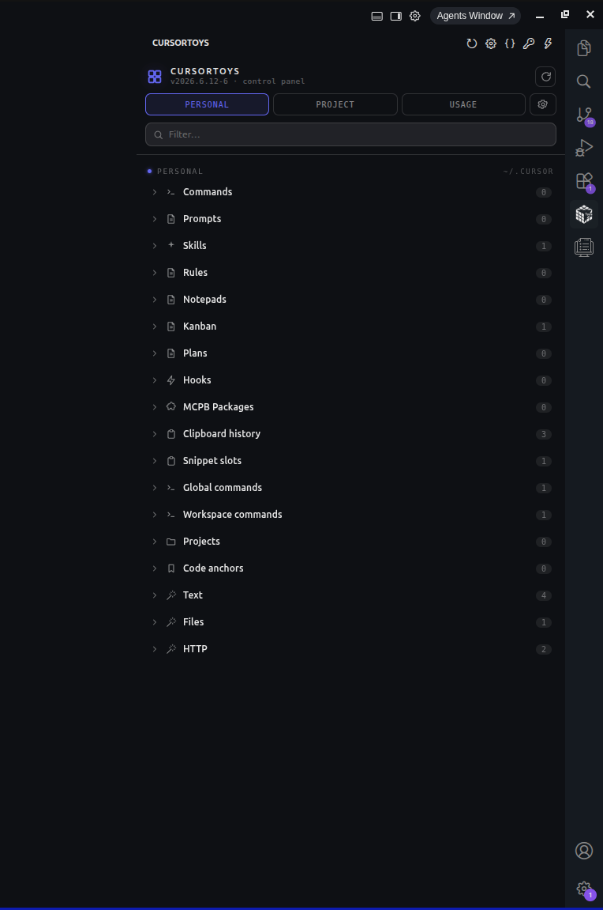
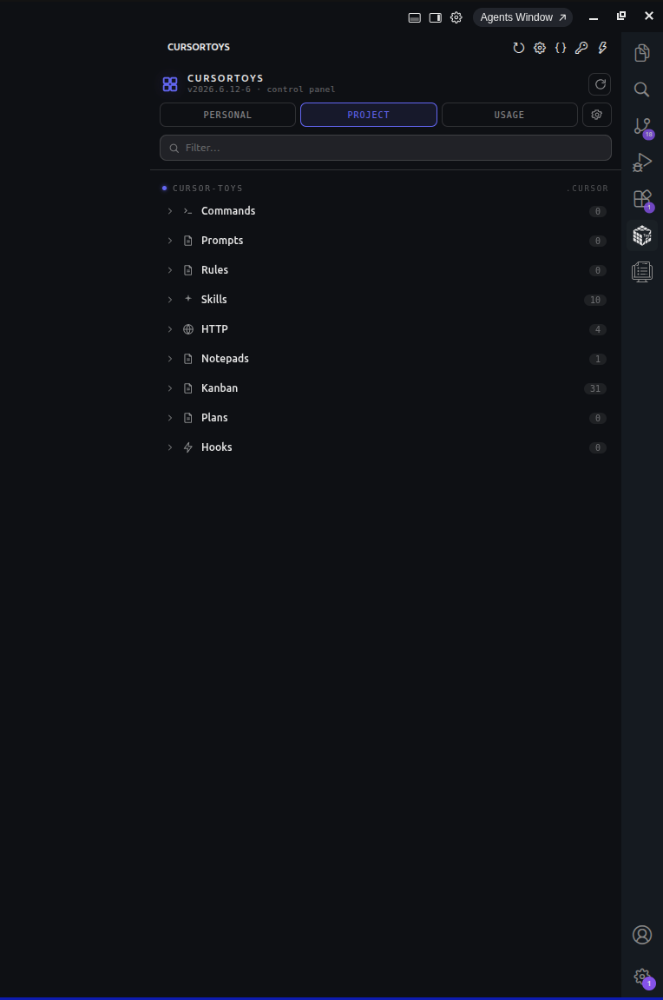
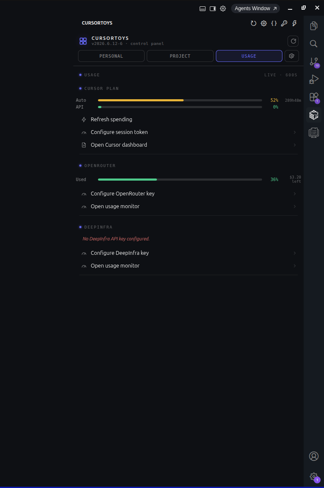

<p align="center">
    <picture>
      <source media="(prefers-color-scheme: light)" srcset="./resources/icon.png" width="200" />
      
  </picture>
</p>
<p align="center">
  <strong>Cursor utilities that keep you in the editor.</strong><br/>
  Test APIs, share AI configs, and manage your Cursor workspace — without context switching.
</p>

[](https://github.com/CursorToys/cursor-toys/actions/workflows/publish.yml)
[](https://open-vsx.org/extension/godrix/cursor-toys)
[](LICENSE)

<p align="center">
  
  &nbsp;
  
  &nbsp;
  
</p>
<p align="center"><sub>Control panel — Personal · Project · Usage</sub></p>

<h3 align="center">
  <a href="#-installation">Installation</a>
  <span> · </span>
  <a href="#-utilities">Utilities</a>
  <span> · </span>
  <a href="#-quick-start">Quick Start</a>
  <span> · </span>
  <a href="#-whats-new">What's New</a>
</h3>

## Why CursorToys

CursorToys is built around a simple DX idea: **the best workflow is the one you never leave the editor for.**

- **When you need to see your project structure** → right-click any folder and generate a formatted tree for docs or AI context.
- **When you need to hit an API** → write a `.req` file, click Send Request, assert the response.
- **When you want to share a command** → generate a link; your teammate imports with `Cmd+Shift+I`.
- **When you organize AI assets** → browse commands, prompts, skills, and hooks in the **Control panel** (CursorToys activity bar).
- **When you need a CursorToys action fast** → `Ctrl+T` / `Cmd+T` opens the **CursorToys Command Palette** (sorted by your most-used actions).

Everything below follows that pattern: short path from intent to action, progressive detail when you need it.

## 🔨 Utilities

| Utility | What it does |
|:--------|:-------------|
| [🎛️ Control Panel](#️-control-panel) | Unified CursorToys sidebar — Personal, Project, Usage, and Config in one webview. |
| [⚡ CursorToys Command Palette](#-cursortoys-command-palette) | `Ctrl+T` / `Cmd+T` — quick actions sorted by usage. |
| [🌳 Project Tree Generation](#-project-tree-generation) | Generate formatted directory trees for documentation or AI context. |
| [🌐 In-Editor API Testing](#-in-editor-api-testing) | Run and assert HTTP requests from `.req` files without leaving Cursor. |
| [🔗 Instant Sharing](#-instant-sharing) | Turn commands, rules, and prompts into shareable links in one click. |
| [🤖 AI Text Refinement](#-ai-text-refinement) | Polish selected text or clipboard with Google Gemini. |
| [📚 Personal Libraries](#-personal-libraries) | Reusable personal commands and prompts across all projects. |
| [🎓 Skills Management](#-skills-management) | Browse, organize, and share Cursor Agent Skills. |
| [📓 Notepads](#-notepads) | Personal and project markdown notes in `.cursortoys/notepads/`. |
| [📋 Kanban Board](#-kanban-board) | File-backed board in `.cursortoys/kanban/` (personal + workspace). |
| [📎 Clipboard Manager](#-clipboard-manager) | Copy/cut history, snippet slots (`clip01`), saved terminal commands. |
| [🪝 Cursor Hooks](#-cursor-hooks) | Manage personal and project `hooks.json` from the Control panel. |
| [💬 Chat Integration](#-chat-integration) | Send selections and prompts to Cursor chat faster. |
| [🗜️ File Minification](#️-file-minification) | Minify JSON, HTML, CSS, JS, and more — files or clipboard. |
| [🌐 GitHub Gist Integration](#-github-gist-integration) | Share and import via Gist for browser-friendly links. |
| [🔌 MCP Server](#-mcp-server-built-in) | Built-in MCP: agents control Kanban, HTTP, assets, and more via tools/resources/prompts. |
| [📦 MCPB Packages](#-mcpb-packages) | Install MCP server bundles (`.mcpb`) into Cursor with preview. |
| [📊 Spending (API usage)](#-spending-cursor-api-usage) | See Cursor Auto/API usage % in the status bar. |
| [🧪 DeepSpec](#-deepspec) | Spec-driven dev — install the separate **DeepSpec** extension (`godrix.deepspec`). |
| [Explorer sidebar visibility](#explorer-sidebar-visibility) | Hide individual CursorToys trees in the Explorer. |

### 🎛️ Control Panel

**One place for all CursorToys assets and settings** — open the **CursorToys** view in the activity bar.

- **Personal** — commands, prompts, skills, rules, notepads, kanban, plans, hooks, MCPB packages, clipboard (history, snippet slots, saved commands), pinned/recent projects, code anchors, and utils (minify, trim, tree generation, etc.).
- **Project** — same asset categories scoped to each open workspace folder (commands, prompts, rules, skills, HTTP, notepads, kanban, plans, hooks).
- **Usage** — live progress bars for Cursor plan (Auto % and API %), OpenRouter credits, and DeepInfra balance; refresh actions and dashboard links; auto-polls on the configured interval.
- **Config** — shortcuts (settings.json, Command Palette, What's New) plus the full CursorToys settings tree with inline boolean toggles and edit actions for other types.
- **Search** — filter items on Personal, Project, and Config tabs.
- **Reorder** — drag section headers on Personal and Project tabs by the grip handle; order is saved across sessions.
- **Status bar** — Spending and Usage Monitor items focus the Control panel.
- Title bar: Refresh, Open settings.json, Configure keys, Command Palette.

Explorer sidebar trees (`cursorToys.sidebar.explorerViews`) remain available for users who prefer duplicate views under Files.

### ⚡ CursorToys Command Palette

**Your shortcut to CursorToys actions** — like `Ctrl+P` for files, but for extension workflows.

- **`Ctrl+T` / `Cmd+T`** — open the palette from anywhere (status bar **CursorToys** item does the same).
- **Most-used first** — entries reorder as you use them (counts stored in extension global state).
- Includes: import, new notepad, Kanban board, usage monitor, minify/trim tools, spending refresh, and more.
- Command: **CursorToys: Command Palette** (formerly “Show Menu”).

### 🌳 Project Tree Generation

**Instantly visualize and share your project structure.**

- Right-click any folder in the Explorer and select **CursorToys: Generate Tree** to copy a beautifully formatted directory tree to your clipboard.
- Select **CursorToys: Generate Tree & Send to Chat** to inject the folder structure directly into your Cursor chat, providing immediate context to the AI.
- The generated tree uses clean box-drawing characters (`├──`, `└──`, `│`), respects `.gitignore` rules from the repository root (including nested `.gitignore` files), and applies safety limits (max depth and file count) to prevent performance issues in large projects.
- Perfect for generating READMEs, sharing architecture context, or giving the AI a bird's-eye view of your workspace.

### 🌐 In-Editor API Testing

**Test APIs where you code** — REST client with environments, helpers, and `@assert()` automation.

- Run requests from `.req` / `.request` files via CodeLens (cURL or `METHOD URL` syntax).
- **Visual request editor** (Postman-style): open `.req` files from the Control panel (Project tab) or Explorer HTTP tree to edit method, URL, headers, and body; **Send**, **Copy cURL**, and **New request** in the toolbar.
- **New HTTP request** — Command Palette (`CursorToys: New HTTP Request`), HTTP sidebar `+` button, Explorer right-click on `.cursor/http/`, or Control Panel → Project → HTTP; creates `YYYY-MM-DD-XX.req` and opens the visual editor.
- **cURL import** — paste a `curl …` command into the URL field in the visual editor to fill method, URL, headers, and body (like Postman/Insomnia).
- Use **Open as text** or disable the visual editor via `cursorToys.httpRequestEditor.enabled`.
- Use `{{variableName}}` from project-root `.env*` files; switch environments instantly.
- Dynamic helpers: `{{@uuid()}}`, `{{@datetime}}`, `{{@userAgent()}}`, `{{@lorem()}}`, and more.
- Responses open in a reusable panel by default (`cursorToys.httpRequestResponseView`).

```http
/*
 * @assert("Status should be 200", "res.status", "equals", 200)
 * @assert("Response should have userId", "res.body.userId", "isDefined")
 */
GET https://api.example.com/user/123
```

<details>
<summary><strong>HTTP assertions — operators, examples, and settings</strong></summary>

**Operators (27+):** `equals`, `gt`, `contains`, `matches`, `isDefined`, `isArray`, `between`, `length`, and more.

**Expression paths:** `res.status`, `res.headers.content-type`, `res.body.users[0].name`

**Settings:**
```json
{
  "cursorToys.httpAssertionsEnabled": true,
  "cursorToys.httpAssertionsShowInline": true,
  "cursorToys.httpAssertionsFailOnError": false
}
```

**HTTP skill:** Right-click your HTTP folder → **CursorToys: Add Skill: HTTP Requests Documentation** — the AI gets full docs for `.req` files, env vars, and assertions.

</details>

### 🔗 Instant Sharing

**Share AI configs as links** — no screenshots, no manual copy-paste.

- Generate deeplinks, web URLs, or CursorToys compressed format from commands, rules, prompts, and skills.
- Import anything with `Cmd+Shift+I` / `Ctrl+Shift+I`.
- Sync team instructions: one link, same file on every machine.
- [Chrome extension](https://chromewebstore.google.com/detail/cursortoys/kndhfkcjndndofieoceaknoapaadjebb) sends web selections to Cursor via deeplink.

### 🤖 AI Text Refinement

**Improve text in place** — powered by Google Gemini, keys stored in VS Code Secrets.

- `Cmd+Shift+R` / `Ctrl+Shift+R` — refine selection; `Cmd+Alt+Shift+R` — refine clipboard.
- **Process with Prompt** — run any prompt from your personal or project library on selected text.
- Models: Gemini 2.5 Flash/Pro; preserves language and intent.
- First use prompts for an API key ([Google AI Studio](https://aistudio.google.com/apikey)).

### 📚 Personal Libraries

**Your commands and prompts, everywhere** — personal (`~/.cursor/`, `~/.claude/`, or `~/.agents/` when configured) and project (`.{baseFolder}/`) libraries in the Control panel and optional Explorer trees.

- Browse, rename, delete, and reveal files; filter by extension.
- Organize with folders and drag-and-drop.
- Share from the tree via CursorToys format or deeplink.
- **Folder settings:** `cursorToys.commandsFolder` (`cursor` | `claude` | `agents`); `cursorToys.personalCommandsView` (`both` shows all three, or pick one); `cursorToys.baseFolder` for workspace paths (e.g. `agents` → `.agents/`).

### 🎓 Skills Management

**Manage Agent Skills visually** — personal and workspace skills in one tree.

- Folder hierarchy mirrors disk; auto-detects `SKILL.md` under `.cursor/skills/`, `.claude/skills/`, and `.agents/skills/`.
- **Add Skill Remote** — Command Palette, Skills sidebar, or Control Panel: paste a GitHub repo or folder URL, pick discovered skills, import to personal or project library. MCP: `skill_remote_discover`, `skill_remote_import`.
- Share individual skills or folders as bundles; CodeLens on `SKILL.md`.
- Create templates, move skills to personal library, import from links.

### 📓 Notepads

**Markdown notes for you and your project** — stored under `.cursortoys/notepads/` (configurable via `cursorToys.extensionDataFolder`, default `cursortoys`).

- **Personal** (`~/.cursortoys/notepads/`) and **workspace** categories in the Control panel (same pattern as Plans).
- Legacy `.cursor/notepads/` is still used when `.cursortoys/notepads/` is empty.
- Optional status bar icon: `cursorToys.notepads.showStatusBar`.
- Create, rename, delete; share notepads or folders via CursorToys or Gist.

### 📋 Kanban Board

**Lightweight task board stored as markdown** — one card per file in `.cursortoys/kanban/` (personal and/or workspace).

- Legacy `.{baseFolder}/kanban/` remains supported when `.cursortoys/kanban/` is empty for that scope.
- Board webview tabs **Workspace | Personal** when a personal board exists.
- Optional status bar icon: `cursorToys.kanban.showStatusBar`.

- Frontmatter field `status`: `backlog`, `todo`, `doing`, or `done`.
- Optional `tags` in frontmatter (`name` or `name:#hexcolor` per tag) with colored pills on cards.
- **CursorToys: Open Kanban Board** — four-column webview (Backlog, Todo, Doing, Done) with drag-and-drop; edits persist to disk.
- Control panel and Explorer tree: create, rename, delete, and open cards (same pattern as Notepads).

### 📎 Clipboard Manager

**Reuse recent copies and saved shell commands** without leaving the editor.

- **Ctrl+C / Ctrl+X** in the editor add to history by default (`cursorToys.clipboard.bindStandardKeys`). Palette: **Copy (Add to History)** / **Cut (Add to History)**.
- **Paste from Clipboard History** — `Ctrl+Shift+V` / `Cmd+Shift+V` when the editor is focused (Quick Pick preview).
- **Snippet slots** — save with a **custom name** (Control panel shows the name + preview); stored under `~/.{baseFolder}/clipboard/slots.json`. Rename or remove from the Explorer Clipboard tree context menu.
- **Command clipboard** — save selection or clipboard text as global or workspace commands; copy, run in terminal (with confirmation), pin, duplicate, rename, delete from the Control panel or Explorer Clipboard tree.
- Settings: `cursorToys.clipboard.enabled`, `maxEntries`, `maxEntryChars`, `syncWithSystem`, `previewChars`.

**Other clipboard extensions:** CursorToys does not replace the system copy key by default. Use the CursorToys copy/cut commands (or rebind them), or disable overlapping keybindings in extensions such as *Clipboard Manager* / *Multi Paste* if you prefer a single history UI.

### 🪝 Cursor Hooks

**Configure Cursor hooks without hunting files** — personal and project `hooks.json` listed in the Control panel.
- Control panel lists hooks and linked scripts; create, share, import (`Cmd+Shift+I`), reveal in folder.

### 💬 Chat Integration

**Less friction between code and chat.**

- Send selection to chat (context menu); open chat with a prompt (no URL length limit when supported).
- Auto-submit injection for DeepSpec and refine-and-send flows.
- Generate prompt deeplinks from selected code with file path and line numbers.

### 🗜️ File Minification

**Shrink files and clipboard content** — JSON, HTML, XML, CSS, SVG, JS, TS.

- Context menu or **Minify File** command; clipboard auto-detection with size stats.
- Configurable output suffix.

### 🌐 GitHub Gist Integration

**Share for the web, not just Cursor** — public or private gists with version history.

- Recipients view in the browser; import back with `Cmd+Shift+I`.

### 🔌 MCP Server (built-in)

**Let Cursor agents drive CursorToys** — first-party MCP server embedded in the extension (distinct from MCPB external bundles).

- Enable: **CursorToys → Control panel → Config** or `cursorToys.mcp.enabled` in settings.
- Auto-registers in `~/.cursor/mcp.json` when `cursorToys.mcp.autoRegister` is on (uses Cursor's embedded Node runtime).
- **Tools** (~150+): Kanban, Notepads, HTTP, anchors, assets, hooks, plans, clipboard, chat, settings, DeepSpec integration, remote skill import (`skill_remote_discover`, `skill_remote_import`), plus `cursortoys_execute` dispatcher.
- **Resources** (`cursortoys://…`): config snapshot, kanban columns/cards, notepads, HTTP files, anchors, assets, plans, hooks, clipboard history.
- **Prompts**: `kanban-workflow`, `http-test-suite`, `project-inventory`, `share-and-import`, `anchor-navigation`, `notepad-scratchpad`.
- Security: destructive ops require `confirm: true`; secrets redacted; optional audit log at `.cursortoys/mcp-audit.log`.
- **Install skill**: Control panel Config tab → MCP Server → **Install MCP Skill**, command palette, or MCP tool `mcp_install_skill` (bundled template → `.{baseFolder}/skills/cursor-toys-mcp/`).

### 📦 MCPB Packages

**Install MCP bundles into Cursor** — [MCP Bundle](https://github.com/modelcontextprotocol/mcpb) (`.mcpb`) support.

- Preview panel with editable env vars before writing to `~/.cursor/mcp.json`.
- Control panel and Explorer tree: reveal, uninstall; optional `npx @anthropic-ai/mcpb` for verify/unpack (`cursorToys.mcpb.useOfficialCli`).

### 📊 Spending (Cursor API usage)

**Glance at usage from the status bar** — Auto % and API % with tooltip details.

- Token auto-detected from Cursor state or set via **Configure spending session token**.
- Click the status bar item to open the **Control panel** Usage tab; hide/show via commands.

### 🧪 DeepSpec

**Spec-driven development** moved to a dedicated extension: **[DeepSpec](https://github.com/godrix/DeepSpec)** (`godrix.deepspec` on the Marketplace).

- Install via **Control panel → Config → DeepSpec → Install DeepSpec Extension**, or command **CursorToys: Install DeepSpec Extension**.
- Your `.deepspec/` folder and `.cursor/skills/deep-spec/` skill are unchanged.
- Commands are now `deepspec.*` (replacing `cursor-toys.deepspec.*`). Settings: `deepspec.enabled`, `deepspec.reviewPanelColumn`.

### Explorer sidebar visibility

**Optional duplicate trees under Files** — the CursorToys activity bar uses the unified Control panel; Explorer trees are opt-in.

- `cursorToys.sidebar.hiddenViews` — hide Explorer sections: `notepads`, `kanban`, `clipboard`, `commands`, `prompts`, `plans`, `skills`, `hooks`, `mcpb`, `http`, `projects`
- `cursorToys.sidebar.explorerViews` — show selected sections in the Explorer (default: `skills`, `plans`)

### Extension data folder (`.cursortoys/`)

**CursorToys-owned data** (Kanban, Notepads) lives separately from Cursor AI config (commands, rules, prompts, skills):

- Default folder: **`~/.cursortoys/`** and **`{workspace}/.cursortoys/`**
- Setting: `cursorToys.extensionDataFolder` (default: `cursortoys`)
- Legacy `.cursor/kanban` and `.cursor/notepads` still work when the new folder is empty

## 📋 Installation

<details open>
<summary><strong>Open VSX (Recommended)</strong></summary>

1. Open Extensions (`Cmd+Shift+X` / `Ctrl+Shift+X`)
2. Search **"Cursor Command Toys"**
3. Install

[Open VSX Registry](https://open-vsx.org/extension/godrix/cursor-toys)

</details>

<details>
<summary><strong>Manual via VSIX</strong></summary>

1. Download `.vsix` from [GitHub Releases](https://github.com/CursorToys/cursor-toys/releases)
2. Command Palette → **Extensions: Install from VSIX...**

</details>

<details>
<summary><strong>Local build</strong></summary>

```bash
git clone https://github.com/CursorToys/cursor-toys.git
cd cursor-toys
npm install && npm run compile && npm run package
```

Install the generated `.vsix` via Extensions → Install from VSIX.

</details>

<details>
<summary><strong>Maintainers — automated Open VSX publish</strong></summary>

Pushing to **`main`** with a **new `version` in `package.json`** runs [Publish Extension](https://github.com/CursorToys/cursor-toys/actions/workflows/publish.yml): build, publish to [Open VSX](https://open-vsx.org/extension/godrix/cursor-toys), create git tag `v{version}`, and open a [GitHub Release](https://github.com/CursorToys/cursor-toys/releases) with notes from `CHANGELOG.md` (matching `## v{version}` or `## v{base}`) plus the `.vsix` attached. If only `package.json` changed but `version` is unchanged, the workflow skips publish.

**Repository secret (required):** `OPEN_VSX_TOKEN` — [Open VSX access token](https://github.com/eclipse/openvsx/wiki/Publishing-Extensions#1-create-an-access-token) for the `godrix` namespace.

```bash
# Bump version in package.json, commit, push to main
git add package.json
git commit -m "chore: release 2026.6.5-1"
git push origin main
```

</details>

## 🚀 Quick Start

**Three workflows, ~60 seconds.**

**1. Test an API**
```bash
# .cursor/http/api-test.req
curl -X GET https://api.github.com/users/octocat
```
Click **Send Request** above the file → response in the panel.

**2. Share a command**
1. Create `.cursor/commands/my-command.md`
2. Right-click → **Generate Cursor Toys Command**
3. Share the copied link.

**3. Import team config**
1. `Cmd+Shift+I` / `Ctrl+Shift+I`
2. Paste deeplink, CursorToys link, or Gist URL
3. File created in the right folder.

### Essential commands

| Area | Command | Shortcut |
|:-----|:--------|:---------|
| General | CursorToys Command Palette | `Cmd+T` / `Ctrl+T` |
| AI | Refine Selection with AI | `Cmd+Shift+R` / `Ctrl+Shift+R` |
| AI | Import from Link | `Cmd+Shift+I` / `Ctrl+Shift+I` |
| HTTP | Send HTTP Request | CodeLens on `.req` files |
| HTTP | New HTTP Request | Command Palette, HTTP sidebar `+`, Explorer `.cursor/http/` |
| HTTP | Select HTTP Environment | Command Palette |
| Skills | Add Skill Remote | Command Palette, Skills sidebar |
| Share | Generate / Share (commands, rules, prompts) | Context menu, CodeLens |
| Chat | Send Selection to Chat | Context menu |
| Tools | Minify File / Trim & Minify Clipboard | Command Palette |
| Notepads | Focus Notepads (optional status bar) | `cursorToys.notepads.showStatusBar` |
| Kanban | Open Kanban Board (optional status bar) | `cursorToys.kanban.showStatusBar` |

Most actions are also on **CodeLens** and **right-click context menus**. Full list: Command Palette → `CursorToys:`.

## ✨ What's New

**v2026.6.27-1** — see [CHANGELOG](CHANGELOG.md)

- **Add Skill Remote** — import Agent Skills from GitHub repo or folder URLs (Command Palette, Skills sidebar, MCP).
- **`.agents` folder** — configure `cursorToys.commandsFolder`, `personalCommandsView`, or `baseFolder` for `.agents/` alongside `.cursor` and `.claude`.
- **Cursor Pet** — disabling the feature now removes auto-installed activity hooks from `hooks.json`.
- **Removed** Skills Marketplace / recommendations catalog — use remote import or share/import flows instead.

**v2026.6.25-2** — chat auto-submit (`cursorToys.chat.autoSubmit`), HTTP editor polish, personal HTTP environments.

**v2026.6.23-1** — see [CHANGELOG](CHANGELOG.md)

- **HTTP New Request** — create dated `.req` files from the visual editor toolbar, HTTP sidebar, Explorer `.cursor/http/` context menu, or Control Panel.
- **HTTP cURL import** — paste `curl …` into the URL field in the visual editor to populate method, URL, headers, and body.

**v2026.6.23-0** — Cursor Pet (Tamagotchi companion, opt-in via `cursorToys.cursorPet.enabled`).

**v2026.6.14-0** — see [CHANGELOG](CHANGELOG.md)

- **Unified Control Panel** — Personal, Project, Usage, and Config tabs replace the previous stack of activity-bar sidebar trees.
- Search/filter, drag-and-drop reorder, inline settings toggles, and live usage bars (Cursor, OpenRouter, DeepInfra).
- Spending and Usage Monitor status bar items now focus the Control panel.

**v2026.6.8-2**

- **CursorToys Command Palette** — `Ctrl+T` / `Cmd+T`; actions sorted by most-used.
- Settings editor fixes for `cursorToys.notepads.showStatusBar` and `cursorToys.extensionDataFolder`.

**v2026.6.8-1**

- **`.cursortoys/` data folder** — Kanban and Notepads in personal + workspace scopes (`cursorToys.extensionDataFolder`).
- Kanban board **Workspace | Personal** tabs; optional Notepads status bar icon.
- Legacy `.cursor/kanban` and `.cursor/notepads` paths still supported.

**v2026.6.8-0** — Project tree generation from Explorer folders (clipboard or send to chat).

**v2026.6.6-1** — Usage Monitor UI (OpenRouter / DeepInfra dashboards and status bar).

Older releases → [CHANGELOG](CHANGELOG.md).

## 🛣️ Roadmap

- **Command Templates** — Ready-to-use command library
- **Cloud Sync** — Personal libraries across machines
- **Usage Analytics** — Most-used commands at a glance
- **AI Command Builder** — Generate commands with AI
- **Public Marketplace** — Community command discovery
- **Mobile Preview** — HTTP responses at different viewport sizes

## ❤️ CursorToys Community

Thank you to our [active community](https://github.com/CursorToys/cursor-toys/discussions) — bugs, docs, design feedback, and features shape every release.

## 🤝 Contributing

Contributions welcome: code, specs, design, docs, bug reports. Read [CONTRIBUTING.md](CONTRIBUTING.md) before starting a feature; see [AGENTS.md](AGENTS.md) for dev setup.

## 📄 Code of Conduct

[Microsoft Open Source Code of Conduct](https://opensource.microsoft.com/codeofconduct/)

## 🔒 Privacy

No personal or sensitive data collected. See [Privacy Policy](https://github.com/CursorToys/cursor-toys/blob/main/PRIVACY.md).

## 📝 License

MIT — see [LICENSE](LICENSE).

---

**Made with ❤️ for the Cursor community**
